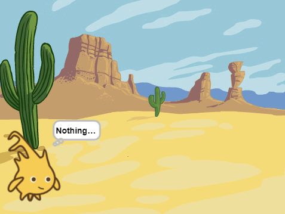
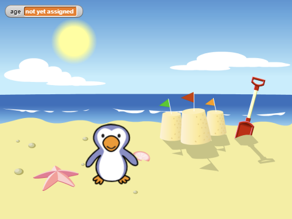
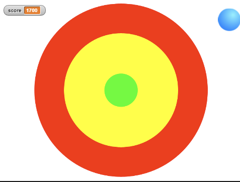
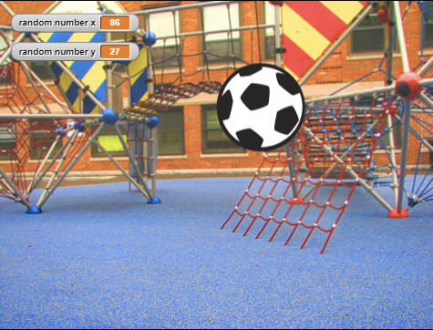
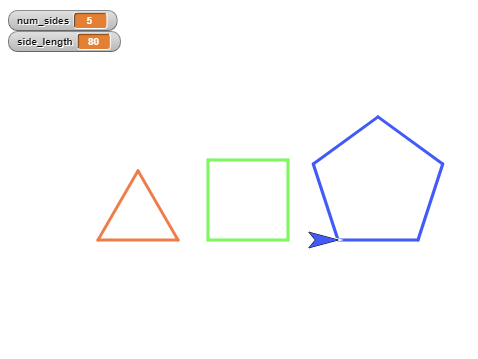
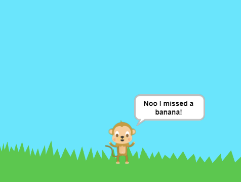
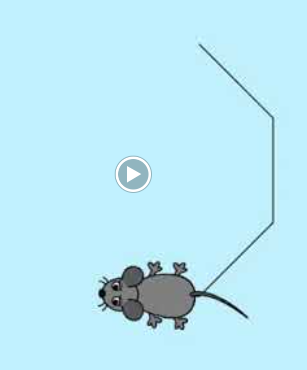
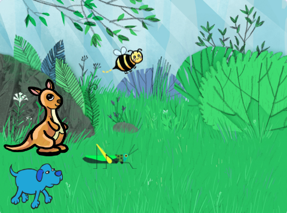
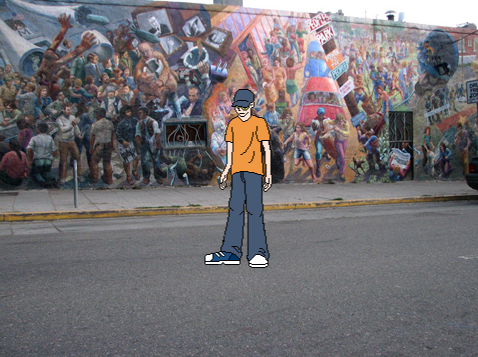
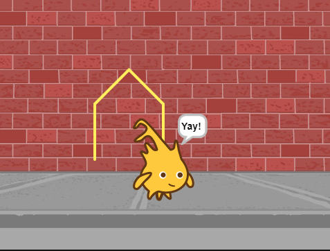

# Welcome to my Online Teaching Programming Portfolio

My name is Richie and I am a CS major who transferred to UCSD in Fall 2020 from a local college. My undergrduate work at UCSD has made me become familiar with SQL, JavaScript, HTML, CSS, SystemVerilog, Python (including Pandas), and C++.

I will utilize this portfolio to showcase what I learned in my "Teach Computational Thinking" with available projects. I hope I can utilize what I learned at UCSD to understand what it takes to teach computational thinking.

## Contact

- email: rporras@ucsd.edu

## My Projects in Computational Thinking

Click on an image to go to a video

### Painting Instruction Video (2022-05-29)

### Treasure Instruction Video (2022-05-20)

### Beach Instruction Video (2022-05-15)

### Target Instruction Video (2022-05-08)

### Soccer Ball Instruction Video (2022-05-01)

### Shape Instruction Video (2022-04-24)

### Mouse Explanation Video (2022-04-17)

### Mouse Explanation Video (2022-04-16)

### Quest Explanation Video (2022-04-10)

### Snap instructions to Dance

### Snap instructions to Draw a House

### . . . 

> more coming soon 